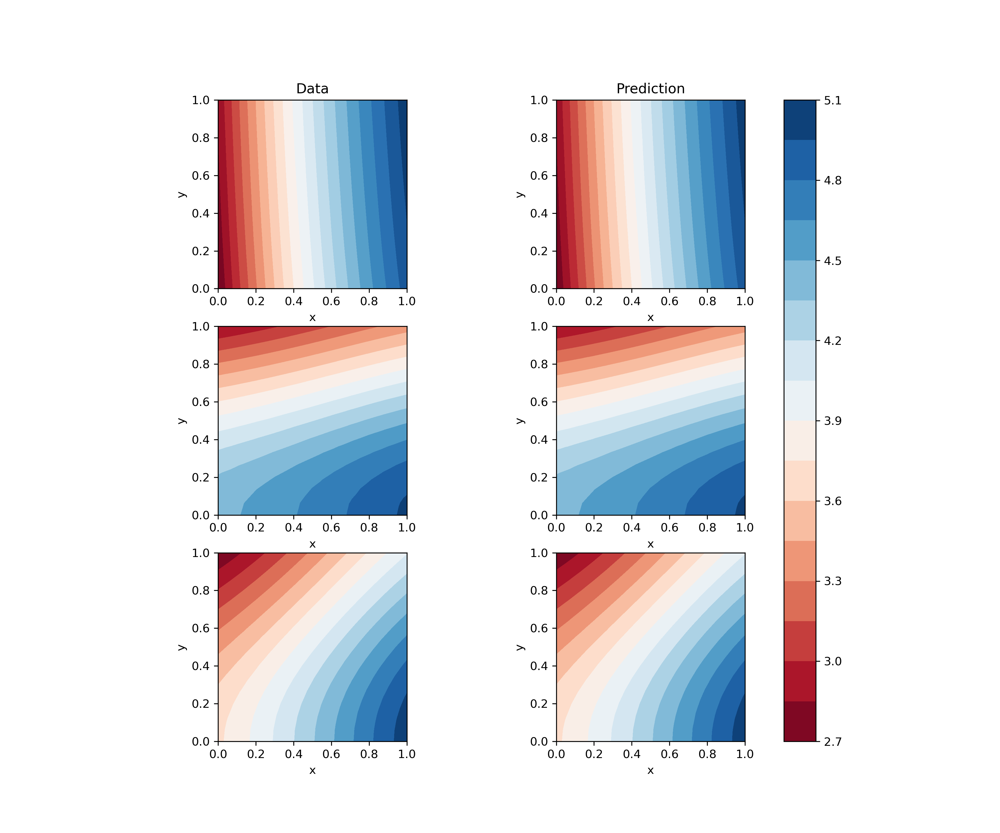
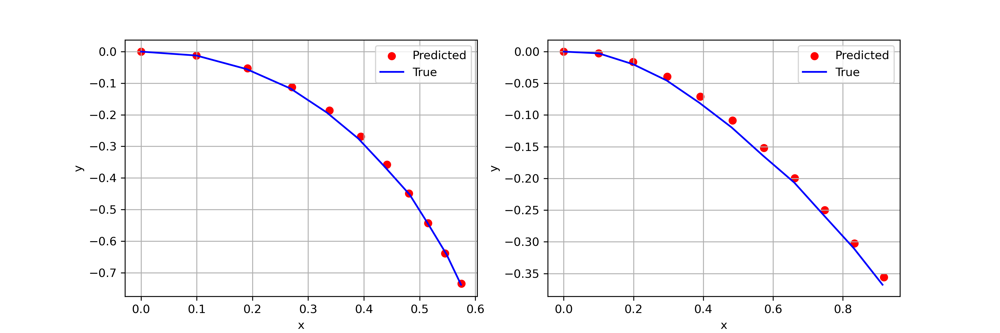
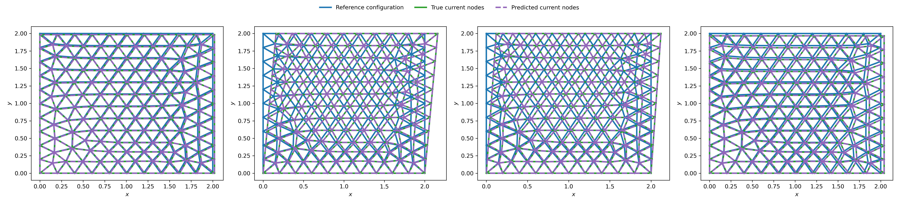

# SR-DEC Examples

SR-DEC: Symbolic Regression with Discrete Exterior Calculus primitives.

This repository contains the scripts to reproduce the benchmark problems discussed in the
paper [_Discovering interpretable physical models with symbolic regression and discrete
exterior calculus_](https://iopscience.iop.org/article/10.1088/2632-2153/ad1af2).

Benchmark problems:

- Poisson equation

<p align="center">

</p>

- Euler's Elastica

<p align="center">

</p>

- Linear Elasticity

<p align="center">

</p>

## Installation

The dependencies are collected in `environment.yaml` and can be installed, after cloning the repository, using [`mamba`]("https://github.com/mamba-org/mamba"):

```bash
$ mamba env create -f environment.yaml
```

## Running the benchmarks

For each benchmark, run the corresponding main script (`stgp_` + benchmark name), for example for Poisson:

```bash
$ python stgp_poisson.py poisson.yaml
```

Check the online [documentation](https://flexgp.readthedocs.io/en/latest/?badge=latest) of
_Flex_ for the meaning of the configuration parameters included in the .yaml files.

## Citing

```
@article{Manti_2024,
    doi = {10.1088/2632-2153/ad1af2},
    url = {https://dx.doi.org/10.1088/2632-2153/ad1af2},
    year = {2024},
    publisher = {IOP Publishing},
    volume = {5},
    number = {1},
    pages = {015005},
    author = {Simone Manti and Alessandro Lucantonio},
    title = {Discovering interpretable physical models using symbolic regression and discrete exterior calculus},
    journal = {Machine Learning: Science and Technology}
}
```
